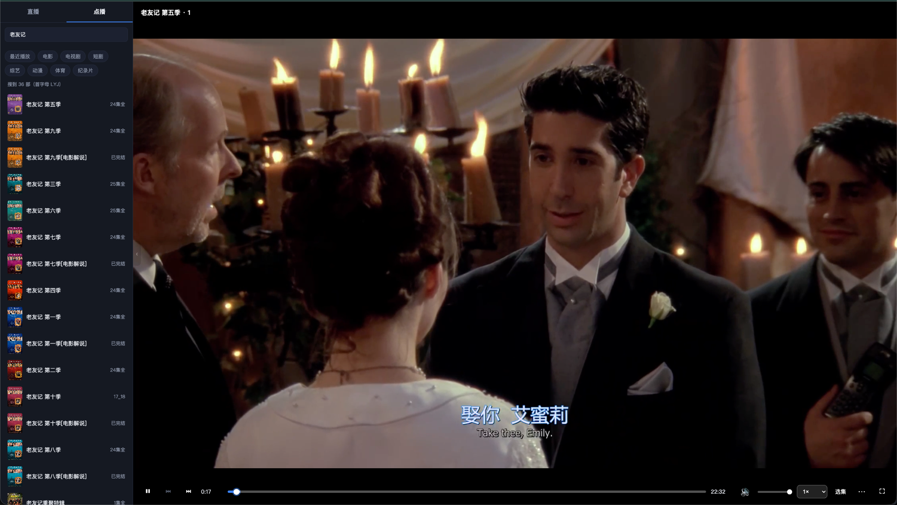

# 淘星TV · 浏览器版

把小米电视上的「淘星TV」IPTV/点播 APK 跑成一个**自定义网页播放器**——原生 App 在后台无头模拟器里按需运行,你只在浏览器里操作:更好的界面、更顺的播放、中文搜索、倍速、人声增强……局域网内任何设备(电脑 / 手机 / 平板)打开网页即可看。

> 这是给**自己已购买的服务**做的自用客户端。**本项目不含、也不分发任何 APK**——请使用你自己从服务商处获得的 APK。



## 主要特性

- **人声增强**:对白小、爆炸/音效大的片子,一键把人声拉清晰(Web Audio 动态压缩,默认开启,藏在「更多」菜单里)。
- **合并搜索**:一个入口查询「电视点播」和「环球剧场」两套目录,第一套返回后先显示结果,第二套返回后自动合并；按完整片名筛选、同名节目合并。有两套片源时默认「电视点播」，与电视首页点播入口一致，详情页可手动切换。支持中文片名、拼音首字母,以及已登记的英文别名(如 `Silo`)。
- **倍速播放**:0.75 / 1 / 1.25 / 1.5 / 2×。
- **点播缓冲**:浏览器支持原片编码时只转封装。浏览器保留约两分钟待播内容，后台另用最多 256 MiB 临时磁盘缓存继续预取；源断流或取流 App 重启时保留这些内容并续接。切集、跳转或关闭页面会释放缓存。浏览器也保留最近数分钟的已播内容，在缓冲范围内快退可直接播放。目录、详情和搜索结果会短时缓存。
- **暂停续播**:暂停时继续补充并保留缓存，续播直接使用已有内容；异常恢复和转码回退也保留用户的暂停状态，不会因后台恢复而自行播放。
- **点播下载队列**:在选集旁点击「下载」，按加入顺序逐集保存 MP4 到指定目录。队列在服务端运行，关闭网页后继续；播放占用取流时可在下载面板点击「停止播放并开始下载」，当前进度会保存，稍后可继续观看。断流后从已保存进度附近续取，失败任务可重试。
- **网页登录(全后台)**:首次在网页输账号密码即可,凭据本地持久化、登出后自动登录——**全程不碰模拟器**。
- **直播 + 点播**:355+ 直播频道(带台标)、电影/剧集/综艺/动漫等点播(带海报),点播支持选集、上/下集、片尾自动下一集。已确认硬件重编码有问题的直播源直接转封装。
- **播放体验**:进度条三色(已播/已缓冲/未缓冲)、单击暂停、双击全屏、空格/方向键(±15秒 seek、音量)、可收起侧栏让视频占满整页、刷新停留在当前进度、最近播放列表。
- **按需 + 减少冷启动**:打开网页才唤醒模拟器；关页后一小时内保留热引擎，重新打开通常直接加载。超过一小时才释放模拟器约 1 GB 内存；可用 `IDLE_MS` 调整。

## 工作原理

```
浏览器 (网页UI, mpegts.js)
   │  HTTP / MPEG-TS
   ▼
Node 服务 (server.js)  ── Frida 注入 ──▶  Android 模拟器里的淘星TV APK
   │  ffmpeg 转封装 / 必要时硬件转码                  (VideoClient P2P 取流)
   ▼
localhost:8090 (也支持 /TXTV/ 路径)
```

- APK 是 ARM 的,用 **ARM64 Android TV 模拟器**原生跑(Apple Silicon 上不用转译)。
- 用 **Frida** 调用 APP 内部的 `VideoClient.playbackStart / vodStart`(P2P 取流,返回本地 MPEG-TS 端口)、`icSearch / icStaticDecode`(点播目录/搜索)等。
- **ffmpeg** 为点播优先只转封装,浏览器不支持源编码时才用 VideoToolbox 转码；直播继续转码,由 `mpegts.js` 播放。
- 登录 = 用 Frida 把账号密码写进 APP 的 SharedPreferences,重启 APP 走它自带的启动自动登录+激活流程。

## 环境要求

- **macOS(Apple Silicon 推荐)**、Node 18+、`ffmpeg`(`brew install ffmpeg`)
- **Android SDK + 模拟器**,一个 **ARM64 Android TV 系统镜像**(如 `system-images;android-33;android-tv;arm64-v8a`)
- **已 root 的模拟器**(rootAVD + Magisk)+ 对应架构的 **frida-server**(arm64)
- **你自己的淘星TV APK**(`com.wys.iptvgo`)+ 一个有效账号

> 项目当前按作者的 macOS/Homebrew 环境编写(路径见 `start.sh` 里的环境变量,可覆盖)。其他环境需自行调整。

## 快速开始

```bash
# 1. 装依赖
npm install

# 2. 下载对应架构的 frida-server(arm64)放到项目根目录并命名为 frida-server
#    https://github.com/frida/frida/releases  (版本需与 npm 的 frida 主版本一致)

# 3. 准备模拟器:创建 AVD、安装你的 APK、root、推送并启动 frida-server
#    (AVD 名默认 TaoxingTV,可用环境变量 AVD 覆盖)

# 4. 启动服务(常驻守护,模拟器按需起/闲时关)
./start.sh              # 或 node server.js
```

浏览器打开 **http://localhost:8090**。首次会让你输账号密码登录(之后自动登录)。

下载目录在点播页的「下载队列」中设置，默认是运行服务的 Mac 上的 `~/Downloads`。目录须已存在且可写；每个新任务使用加入队列时的目录。下载完成后队列会显示文件的完整路径。源长时间无法供数时任务会标为失败，可在队列中重试；下载片段存放在项目的 `cache/downloads/`，合并和校验时在目标目录使用 `.partial` 临时文件，不会把不完整文件当成正式 MP4。

点播播放的额外预缓存默认上限为 256 MiB，可用 `VOD_BUFFER_MB` 调整（0 关闭，最大 1024）。临时文件创建后即解除目录链接，播放关闭或服务退出后自动释放；它只用于当前播放会话，不是离线收藏。下载队列独立直接读取，不受这份播放缓存的容量或浏览器缓冲门限限制。

局域网其他设备用这台机器的 IP:8090 访问即可。可选:用 nginx 反代到 80 端口做成 `http://<主机名>` 免端口访问(**流媒体反代务必 `proxy_buffering off`**)。

本机也可打开 **http://localhost:8090/TXTV/**。若要省略端口，先让 macOS 自带 Apache 转发 `/TXTV/`：

```bash
sudo cp /etc/apache2/httpd.conf /etc/apache2/httpd.conf.taoxingtv-backup
sudo sed -i '' -e 's/^#LoadModule proxy_module /LoadModule proxy_module /' -e 's/^#LoadModule proxy_http_module /LoadModule proxy_http_module /' /etc/apache2/httpd.conf
sudo cp deploy/apache-localhost-txtv.conf /etc/apache2/other/taoxingtv.conf
sudo apachectl configtest && sudo apachectl start
```

然后打开 **http://localhost/TXTV/**。这是一次性的管理员操作：80 端口需要系统权限。若 Apache 已占用 80 端口或已有配置，先检查现有站点再合并配置。浏览器在新端口下会使用另一份 `localStorage`，所以原地址的观看进度不会自动搬过来；账号凭据仍由同一台 Node 服务保存。

## 声明

- 仅供**已购买服务的自用**,请遵守服务商条款与当地法律,尊重版权。
- **不分发 APK / 账号 / 任何内容**;凭据只存在你本地(`creds.json`,已在 `.gitignore`,永不进仓库)。
- 逆向仅用于互操作性(让自己买的服务在更好的界面上看)。
